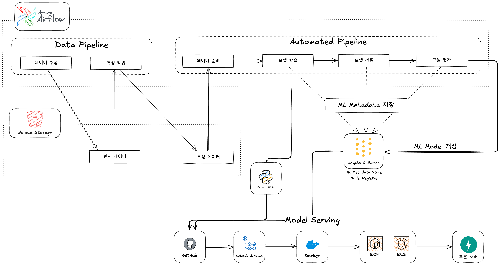

# 국내 여행 날씨 예측 서비스

## 📋 개요

국내 여행을 계획하는 사용자들이 여행 기간의 날씨를 미리 예측할 수 있는 서비스입니다.
MLOps 파이프라인을 활용해 기상청 공공데이터를 수집하고, 머신러닝 모델을 통해 정확한 날씨 예측을 제공합니다.
자동화된 배포 시스템으로 지속적인 모델 개선이 이루어집니다.

### 주요 특징

- **정확한 날씨 예측**: 기상청 데이터 기반의 머신러닝 모델을 통한 정확한 예측
- **사용자 친화적 인터페이스**: 지역과 날짜만 입력하면 예측 결과 확인
- **자동화된 MLOps 파이프라인**: 데이터 수집부터 모델 배포까지 자동화
- **확장 가능한 아키텍처**: 클라우드 기반 확장성 제공

## 💻 프로젝트 소개

### 프로젝트 배경

국내 여행 계획 시 날씨 정보는 중요한 고려사항입니다. 본 프로젝트는 기상청 공공데이터와 머신러닝을 결합하여 사용자에게 정확한 날씨 예측 정보를 제공하는 것을 목표로 합니다.

### 프로젝트 목표

- MLOps 파이프라인을 구축하여 국내 여행지의 미래 날씨를 예측하는 서비스 개발
- 기상청 공공데이터 API를 활용한 데이터 수집 및 처리 자동화
- 효율적인 ML 모델 관리 및 배포 자동화 구현
- Docker 컨테이너를 활용한 서비스 환경 구성

### 작품 소개

- 사용자가 국내 여행을 계획할 때 특정 지역과 날짜를 입력하면 해당 기간의 날씨를 예측
- 기상청 API에서 수집한 데이터를 기반으로 머신러닝 모델을 통해 정확한 날씨 예측 제공
- 자동화된 파이프라인을 통한 지속적인 모델 학습 및 개선
- MLOps 전체 파이프라인 구현 및 운영

## 👨‍👩‍👦‍👦 팀 구성원

|  |  |  |  |  |
|:-----------------------------------------------------------:|--------------------------------------------------------------:|--------------------------------------------------------------:|--------------------------------------------------------------:|-------------------------------------------------------------:|
|             [조의영](https://github.com/yuiyeong)              |                         [고민주](https://github.com/PaperToCode) |                         [이나경](https://github.com/imnaagyeong) |                             [이승현](https://github.com/shyio06) |                          [편아현](https://github.com/vusdkvus1) |
|                   팀장, 데이터 전처리 및 피쳐 엔지니어링                    |                                            데이터 전처리 및 피쳐 엔지니어링 |                                            데이터 전처리 및 피쳐 엔지니어링 |                                            데이터 전처리 및 피쳐 엔지니어링 |                                           데이터 전처리 및 피쳐 엔지니어링 |

## 🔨 개발 환경 및 기술 스택

- **주 언어**: Python 3.11
- **패키지 관리**: Poetry
- **데이터 소스**: 기상청 공공데이터 API
- **데이터 저장소**: Naver Ncloud Storage (오픈 베타)
- **워크플로우 관리**: Apache Airflow
- **ML 실험 추적**: Weights & Biases (wandb)
- **API 서버**: FastAPI
- **컨테이너화**: Docker, docker-compose
- **CI/CD**: GitHub Actions
- **버전 및 이슈 관리**: GitHub

## 📁 프로젝트 구조

```
├── .github/                    # GitHub Actions 워크플로우
│   └── workflows/
├── airflow/                    # Airflow 관련 파일
│   ├── dags/                   # Airflow DAGs
│   ├── plugins/                # Airflow 커스텀 플러그인
│   ├── config/                 # Airflow 설정 파일
│   └── Dockerfile              # Airflow Dockerfile
├── api/                        # FastAPI 애플리케이션
│   ├── main.py                 # FastAPI 메인 앱
│   └── Dockerfile              # FastAPI Dockerfile
├── src/                        # 공통 소스 코드
│   ├── data/                   # 데이터 관련 패키지
│   ├── models/                 # ML 모델 학습 및 평가 관련 패키지
│   └── utils/                  # 유틸리티 패키지
├── tests/                      # 테스트
├── notebooks/                  # Jupyter 노트북
│   ├── fonts/                  # ttf 파일 모음 directory
│   └── notebook_template.ipynb # Jupyter Notebook Template
├── docs/                       # 문서
├── .env.example                # 환경 변수 예시
├── .dockerignore               # Docker ignore 파일
├── .gitignore                  # Git ignore 파일
├── docker-compose.yml          # Docker Compose file
├── pyproject.toml              # 메인 Poetry 설정
└── README.md                   # 프로젝트 README
```

## 🛠️ 작품 아키텍처



### 주요 컴포넌트

#### 1. 데이터 파이프라인 (Data Pipeline)

- **데이터 수집**: 기상청 API에서 날씨 데이터 수집
- **특성 작업**: 수집된 데이터 전처리 및 특성 엔지니어링
- **원시 데이터/특성 데이터**: Ncloud Storage에 저장

#### 2. 자동화 파이프라인 (Automated Pipeline)

- **데이터 준비**: 학습에 필요한 데이터 준비
- **모델 학습**: 날씨 예측 모델 훈련
- **모델 검증**: 학습된 모델의 성능 검증
- **모델 평가**: 최종 모델 평가 및 배포 결정
- **ML 메타데이터 저장**: Weights & Biases를 통한 실험 추적
- **ML 모델 저장**: 모델 레지스트리에 버전 관리와 함께 저장

#### 3. 모델 서빙 (Model Serving)

- **소스 코드**: GitHub 저장소에서 관리
- **CI/CD**: GitHub Actions를 통한 자동화된 빌드 및 배포
- **컨테이너화**: Docker를 통한 애플리케이션 패키징
- **배포**: ECR/ECS를 통한 컨테이너 관리 및 서비스 제공
- **추론 서버**: FastAPI를 활용한 예측 API 서비스

## 🚀 설치 및 실행 방법

본 프로젝트는 Docker를 사용하여 모든 개발 환경을 컨테이너화하고 있습니다. Docker를 통해 일관된 개발 환경을 구축하고 서비스 간 통합을 쉽게 관리할 수 있습니다.

### 사전 요구사항

- [Docker](https://docs.docker.com/get-docker/) (v20.10 이상)
- [Docker Compose](https://docs.docker.com/compose/install/) (v2.0 이상)
- 기상청 공공데이터 포털 API 키 발급
- Naver Cloud Platform 계정 및 Storage 서비스 설정
- Weights & Biases 계정

### 초기 설정 및 실행 방법

#### 1. 저장소 클론

```bash
git clone https://github.com/AIBootcamp13/mlops-cloud-project-mlops_7.git
cd mlops-cloud-project-mlops_7
```

#### 2. 환경 변수 설정

`.env` 파일을 생성하고 필요한 환경 변수를 설정합니다.

```bash
# .env.example 파일을 복사하여 시작
cp .env.example .env

# 편집기로 .env 파일 열기
vi .env  # 또는 선호하는 편집기 사용
```

#### 3. Docker 개발 환경 시작

```bash
# 모든 서비스 빌드 및 시작
docker compose up -d

# 빌드 과정 상세 보기
docker compose up -d --build --verbose
```

#### 4. 서비스 상태 확인

```bash
# 실행 중인 컨테이너 확인
docker compose ps

# 모든 서비스 로그 확인
docker compose logs -f

# 특정 서비스 로그만 확인 (예: airflow-webserver)
docker compose logs -f airflow-webserver
```

#### 5. 서비스 접속

각 서비스는 다음 URL로 접속할 수 있습니다:

- **Airflow UI**: http://localhost:8080
    - 기본 계정: admin / admin
- **FastAPI 문서**: http://localhost:8000/docs
- **Weights & Biases**: 브라우저에서 wandb.ai 계정으로 접속

#### 6. 개발 작업 흐름

```bash
# 코드 변경 후 특정 서비스만 재시작
docker compose restart api  # FastAPI 서비스 재시작

# 특정 서비스만 로그 확인
docker compose logs -f api

# Airflow DAG 변경 후 스케줄러 재시작
docker compose restart airflow-scheduler

# 컨테이너 내부 접속 (디버깅용)
docker compose exec airflow-webserver bash
docker compose exec api bash
```

#### 7. 서비스 중지 및 정리

```bash
# 서비스 중지 (컨테이너 유지)
docker compose stop

# 서비스 중지 및 컨테이너 제거
docker compose down

# 컨테이너, 네트워크, 볼륨 모두 제거 (데이터 초기화)
docker compose down -v

# 캐시된 이미지까지 모두 제거
docker compose down -v --rmi all
```

#### 8. 문제 해결

**로그 확인**: 문제 발생 시 항상 로그를 먼저 확인하세요.

```bash
docker compose logs -f
```

**컨테이너 재시작**: 특정 서비스에 문제가 있는 경우 재시작해 보세요.

```bash
docker compose restart [서비스명]
```

**전체 환경 재구축**: 문제가 계속되면 전체 환경을 다시 빌드해 보세요.

```bash
docker compose down -v
docker compose up -d --build
```

**Airflow 초기화 문제**: Airflow 데이터베이스 초기화에 문제가 있는 경우

```bash
docker compose up airflow-init
```

#### 9. 고급 사용법

**컨테이너 리소스 모니터링**:

```bash
docker stats
```

**특정 서비스만 시작**:

```bash
docker compose up -d airflow-webserver airflow-scheduler
```

**Docker 볼륨 데이터 확인**:

```bash
docker volume inspect mlops_postgres-data
```

- 이제 MLOps 파이프라인을 위한 모든 개발 환경이 Docker를 통해 구성되었습니다.
- 이 환경에서 데이터 수집, 모델 학습, API 서비스 개발 등 모든 작업을 수행할 수 있습니다.

## 🤝 Git으로 협업하기

### Git 명령어 순서

```bash
# 1. 메인 브랜치로 전환
git switch main

# 2. 최신 변경사항 가져오기
git pull

# 3. 새 기능 브랜치 생성
git branch feature/123-some-feature

# 4. 새 브랜치로 전환
git switch feature/123-some-feature

# 5. 작업 진행...

# 6. 변경사항 확인
git status

# 7. 변경 파일 스테이징
git add [작업한 파일]

# 8. 변경사항 커밋 (메시지 컨벤션 준수)
git commit -m "feat: 로그인 기능 구현"

# 9. 원격 저장소에 푸시
git push origin feature/123-some-feature
```

### Pull Request(PR) 생성할 때는,

- GitHub 저장소로 이동하여 "Compare & pull request" 버튼 클릭
- PR 제목과 내용 작성 (작업 내용, 변경 사항, 테스트 방법 등 포함)
- 리뷰어 지정 및 PR 제출

### Branch 이름 컨벤션

- **feature/[이슈번호]-[기능명]** - 새로운 기능 개발 시 (예: `feature/12-login-page`)
- **fix/[이슈번호]-[버그명]** - 버그 수정 시 (예: `fix/3-header-alignment`)
- **docs/[이슈번호]-[문서명]** - 문서 관련 작업 시 (예: `docs/4-api-guide`)

### Commit Message Convention

커밋 메시지는 다음 형식으로 작성합니다.

```
<type>: <subject>

<body>
```

**타입(Type):**

- `feat`: 새로운 기능 추가
- `fix`: 버그 수정
- `docs`: 문서 변경
- `style`: 코드 포맷팅, 세미콜론 누락 등 (코드 변경 없음)
- `refactor`: 코드 리팩토링
- `test`: 테스트 코드 추가/수정
- `chore`: 빌드 프로세스, 패키지 매니저 설정 등 변경
- `conf`: 환경 설정 관련

**예시:**

```
feat: 날씨 예측 API 엔드포인트 추가

- 지역별 날씨 예측 기능 구현
- 날짜 범위 파라미터 지원
```

## 💻 구현 기능

### 1. 데이터 수집 및 전처리 파이프라인

- 기상청 공공데이터 API 연동
    - 기상청 API를 통한 실시간 날씨 데이터 자동 수집 (`src/libs/weather/fetcher.py`)
    - ASOS 관측소 기반 지역별 데이터 수집 (`src/libs/weather/asosstation.py`)

- 데이터 전처리 자동화
    - 결측치 처리 및 보간 (`src/data/imputer.py`)
    - 특성 변환 및 스케일링 (`src/data/transformer.py`)
    - 특성 선택 및 엔지니어링 (`src/data/selection.py`)

### 2. MLOps 자동화 파이프라인

- Airflow DAG 기반 워크플로우 자동화
    - 데이터 수집 파이프라인 (`airflow/dags/data_pipeline.py`)
    - 모델 학습 및 배포 파이프라인 (`airflow/dags/automated_pipeline.py`)
    - 모듈화된 태스크 설계 (`airflow/tasks/` 디렉토리)

- 모델 학습 및 평가
    - XGBoost, LightGBM, RandomForest 등 다양한 모델 지원 (`src/models/`)
    - 교차 검증 및 하이퍼파라미터 최적화
    - 모델 성능 지표 모니터링 (`src/evaluation/metrics.py`)

- 실험 추적 및 모델 관리
    - Weights & Biases 연동을 통한 모델 실험 추적 (`src/tracker/wandb.py`)
    - 최적 모델 자동 선택 및 저장 (`airflow/tasks/save_best_model.py`)
    - 모델 버전 관리 및 아티팩트 추적

### 3. 클라우드 인프라 및 스토리지

- Naver Cloud Storage 연동
    - 원시 데이터 및 전처리된 데이터 저장 (`src/libs/storage.py`)
    - 학습된 모델 파일 관리 및 버전 추적
    - 클라우드 스토리지 접근 및 관리 유틸리티

### 4. API 서비스

- FastAPI 기반 예측 API
    - RESTful API 엔드포인트 제공 (`api/main.py`)
    - 지역 및 날짜 기반 날씨 예측 서비스
    - 모델 추론 로직 구현 (`api/inference.py`)

### 5. 컨테이너화 및 배포

- Docker 기반 환경 구성
    - Airflow 컨테이너 (`airflow/Dockerfile`)
    - FastAPI 서비스 컨테이너 (`api/Dockerfile`)
    - 다중 서비스 통합 환경 (`docker-compose.yml`)

## 📅 미팅 및 스케쥴

미팅은 마지막날 오후 시간동안 만나서 진행한다.

| 기간            | Day | Task                                              |
|---------------|-----|---------------------------------------------------|
| 05.26 - 05.26 | 1   | • 프로젝트 셋업                                         |
| 05.27 - 05.29 | 3   | • 기상청 API 연동 • 데이터 수집 스크립트 • Ncloud Storage 연동    |
| 05.30 - 05.31 | 2   | • Airflow 설정 및 구성 • 데이터 파이프라인 DAG 구현 • 파이프라인 모니터링 |
| 06.01 - 06.03 | 3   | • 모델 설계 및 구현 • Weights & Biases 연동 • 모델 평가 및 검증   |
| 06.04 - 06.05 | 2   | • FastAPI 서비스 개발 • 모델 서빙 로직 • API 문서화 및 테스트       |
| 06.06 - 06.09 | 4   | • CI/CD • 프로젝트 산출물 제출                             |
| 06.10 - 06.10 | 1   | • 최종 발표                                           |

## 📰 참고자료

- [Running Airflow in Docker](https://airflow.apache.org/docs/apache-airflow/2.11.0/howto/docker-compose/index.html#)
- [FastAPI 공식 문서](https://fastapi.tiangolo.com/ko/)
